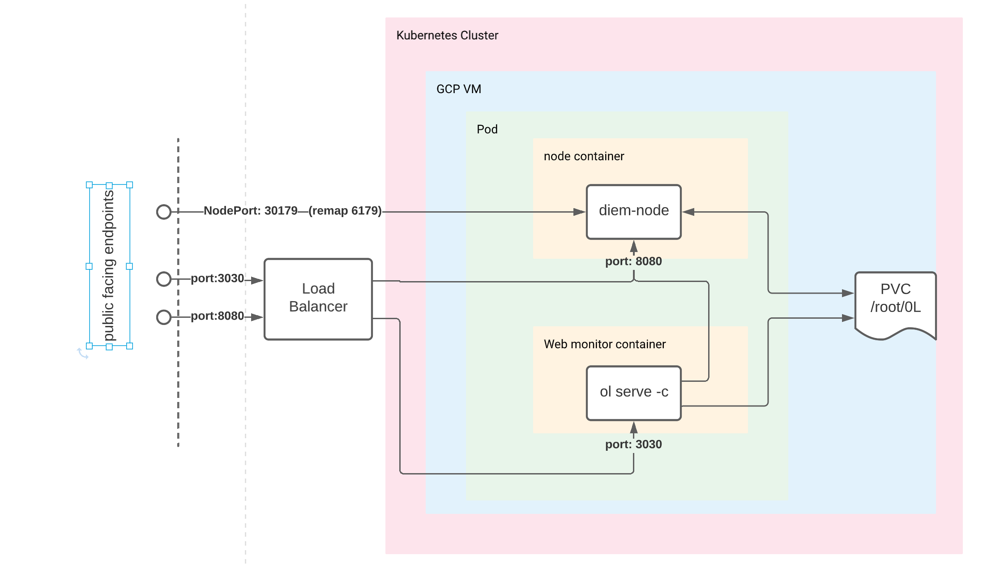

# Kubernetes Deployment for 0L

## Introduction
This is experimental setup to run 0L full node under kubernetes (k8s).
Features:
- Currently only Google cloud k8s provider is supported.
- This setup uses official 0L binaries from <https://github.com/OLSF/libra/releases/latest/download>.
- It creates single node cluster usin e2-standard-4 instance.
- To expose 3030 and 8080 ports it uses a load balancer with static ip.
- For peer port 6179 it uses NodePort 30179.
- Infrastructure to run validator node with this setup is put in place, however tower component is NYI.
- This setup has been tested under Ubuntu 20.04

## Port Wiring Diagram



## Preparation
Install
- Docker (install-docker.h)
- Gcloud (install-cloud.sh)
- Helm (install-helm.sh)

## Create a New Account to Run Full node
```
# 1. generate new mnemonics
./olk generate key

# 2. mine 0-proof, package assets into tar.gz
# it takes about 30 minutes to complete
# do not forget to save assets in tar.gz saved in temp dir
# showed after script completion
./olk onboard validator
# save assets
cp /tmp-xxx/ol.tar.gz /safe-place
```
If you have existing full node keys and proof steps 1,2 can be skipped. Instead, package ~/.0L directory under root folder into tar.gz. Unpacked files must have the following structure:
```
root/.0L/<full node files>
``` 

## Create k8s Cluster
```
# create cluster, firewall, allocate static ip
./olk create cluster cluster-1 project-id
```

## Deploy Full Node
```
./olk deploy node n1

# copy assets
./olk copy assets n1 ~/ol.tar.gz
```


## Uprade Full Node
```
./olk upgrade node n1
```

## Appendix
### Build Docker Image from Official 0L Bits 
This step is required if published image is not obsolete or if you made changes to run-node.sh or Dockerfile.olsf. Create dockerhub account to publish your image. Update olk and helm/ol/vaues.yaml to use your repo and your ta. Search for "tag" in both files.
```
docker login
./build-olsf-container.sh -p # -p publishes to dockerhub
```
